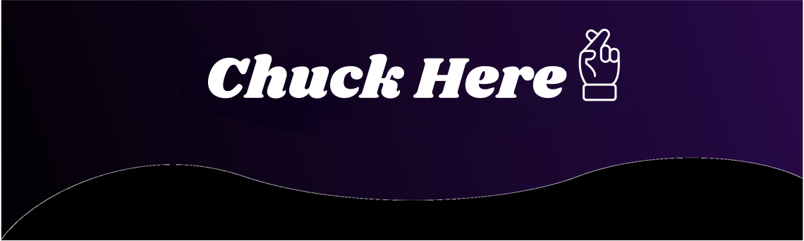

<h1 align="center">Charles Massey</h1>

  <strong>Head of Engineering at iZZi web</strong>

  <code>ChuckMassey</code>

  Here to imagine, create, and bring to life the software you've always dreamed of.
  Turning ideas into powerful digital solutions while always delivering the best
  approach for your boldest innovations.

  Helping businesses build innovative technology solutions across Canada, the
  United States, Panama, France, Turkey, and beyond.

  <a href="http://www.linkedin.com/in/charles-massey-496b08177">LinkedIn</a>
  |
  <a href="mailto:charles@izzi.fr">charles@izzi.fr</a>

---

## About

I lead engineering with a strong focus on clarity, execution, and long-term value.
My work is centered on turning ambitious ideas into reliable, scalable, and
well-crafted software solutions.

Whether the goal is building a product from the ground up, improving an existing
platform, or defining the right technical direction, I aim to deliver a practical
and high-impact approach from concept to launch.

## Connect

Want to learn more about my work?

- LinkedIn: [www.linkedin.com/in/charles-massey-496b08177](http://www.linkedin.com/in/charles-massey-496b08177)
- Contact: [charles@izzi.fr](mailto:charles@izzi.fr)

